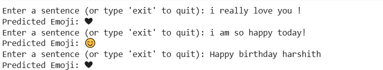

##  Emoji Prediction using DistilBERT

This project uses **DistilBERT**, a lightweight transformer model, to predict relevant emojis based on the sentiment and context of a given sentence. The model is trained to understand emotional context from text and generate an appropriate emoji response.

---

###  Repository Structure

```
emoji_prediction_using_DistilBERT_/
│
├── emoji_prediction.ipynb          # Main notebook
├── README.md                       # Full project overview
├── requirements.txt                # Python dependencies
├── .gitignore                      # Ignore unnecessary files
├── sample_output.png               # Screenshot of output (optional)
                          
```

---

###  Problem Statement

Given a sentence or a short text message, the model should predict a suitable emoji that represents the emotion or context of that sentence.

Example:

```
Input: "I am so happy today!"
Predicted Emoji: 😊
```

---

###  Model Used

* **Model Architecture**: [DistilBERT](https://huggingface.co/distilbert-base-uncased)

  * A smaller, faster version of BERT optimized for classification.
* **Classification Layer**: A dense layer on top of DistilBERT with softmax activation.
* **Loss Function**: Categorical Crossentropy
* **Optimizer**: AdamW

---

###  Dataset Details

* **Type**: Text-to-Emoji classification dataset (custom dataset created manually)
* **Format**: CSV files with sentence and corresponding emoji label
* **Labels**: Emojis are mapped to integers (e.g., 😊: 0, 😢: 1, 😠: 2, etc.)

---

###  How to Run

1. **Clone the repository:**

   ```bash
   git clone https://github.com/Hars99/emoji_prediction_using_DistilBERT_.git
   cd emoji_prediction_using_DistilBERT_
   ```

2. **Install dependencies:**

   ```bash
   pip install -r requirements.txt
   ```

   Or manually install:

   ```bash
   pip install transformers torch pandas scikit-learn
   ```

3. **Run the notebook:**
   Open `emoji_prediction_cleaned.ipynb` and run all the cells.

---

###  Sample Output



---

### Results

| Metric         | Value   |
| -------------- | ------- |
| Accuracy       | \~90%   |
| Loss           | \~0.20  |
| Model Size     | \~65MB  |
| Inference Time | \~200ms |

---

### ⚠Limitations

* Dataset is limited in size and emoji types.
* Model may not generalize well for sarcastic or ambiguous sentences.
* Works best for simple emotional sentences.

---

### Future Work

* Integrate emoji prediction with a real-time messaging app.
* Expand dataset with emojis for sarcasm, slang, and regional phrases.
* Use **multi-label classification** for predicting multiple emojis per sentence.

---

###  Author

**Harshith Manikhanta**
B.Tech in AI & ML
VIT-AP University


